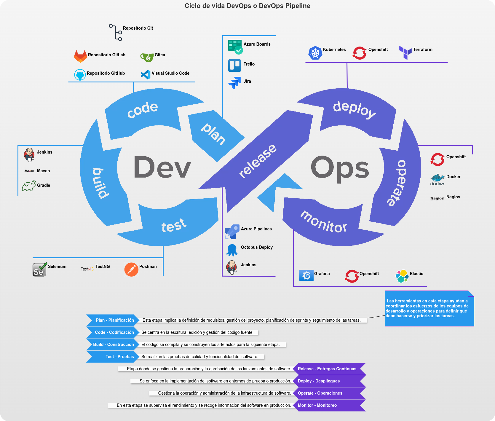

# Ciclo de vida DevOps

## Etapas del [Ciclo DevOps](/definiciones-y-siglas)

### Planificación

Los equipos colaboran para definir los requisitos del software, establecer objetivos y priorizar las tareas. Utilizan herramientas de gestión de proyectos y metodologías ágiles (como <a href="https://es.wikipedia.org/wiki/Scrum_%28desarrollo_de_software%29" target="_blank" rel="noopener noreferrer">Scrum</a> o <a href="https://es.wikipedia.org/wiki/Kanban_%28desarrollo%29" target="_blank" rel="noopener noreferrer">Kanban</a>) para organizar el trabajo.

### Desarrollo    

Se escribe el código fuente para las nuevas funcionalidades o para mejorar las existentes. En esta fase, se fomenta el uso de repositorios de control de versiones como Git para gestionar y seguir los cambios en el código.

### Integración Continua (CI)

A medida que los desarrolladores completan partes del código, este se integra continuamente en un repositorio central. La integración continua implica que el código nuevo se prueba automáticamente cada vez que se agrega o modifica, ayudando a identificar y corregir errores rápidamente.

### Pruebas Continuas

El código integrado se somete a pruebas automáticas (unitarias, de integración, de regresión, etc.) para asegurar su calidad. En una cultura DevOps, se busca tener un alto grado de automatización en las pruebas para detectar fallos lo antes posible.

### Entrega Continua (CD)

Una vez que el código pasa todas las pruebas, se prepara para ser desplegado. En esta fase, la entrega continua asegura que cualquier cambio que pase las pruebas esté listo para ser lanzado a producción en cualquier momento, reduciendo el tiempo de entrega de nuevas funcionalidades al cliente.

### Despliegue Continuo

En algunos entornos, la entrega continua va un paso más allá con el despliegue continuo, donde los cambios en el código se despliegan automáticamente en el entorno de producción después de pasar las pruebas. Esto permite actualizaciones frecuentes y rápidas en producción.

### Monitoreo y Operaciones

Una vez desplegado, el software se monitorea continuamente para asegurar su rendimiento y disponibilidad. Las herramientas de monitoreo ayudan a detectar problemas en tiempo real y permiten a los equipos reaccionar rápidamente a incidentes. Además, el feedback del monitoreo se utiliza para mejorar el ciclo de desarrollo.

### Retroalimentación y Mejora Continua

La retroalimentación del monitoreo, las métricas de uso, los errores y la satisfacción del cliente se utilizan para mejorar continuamente el software y el proceso de desarrollo. La cultura DevOps fomenta la mejora continua y la innovación.
