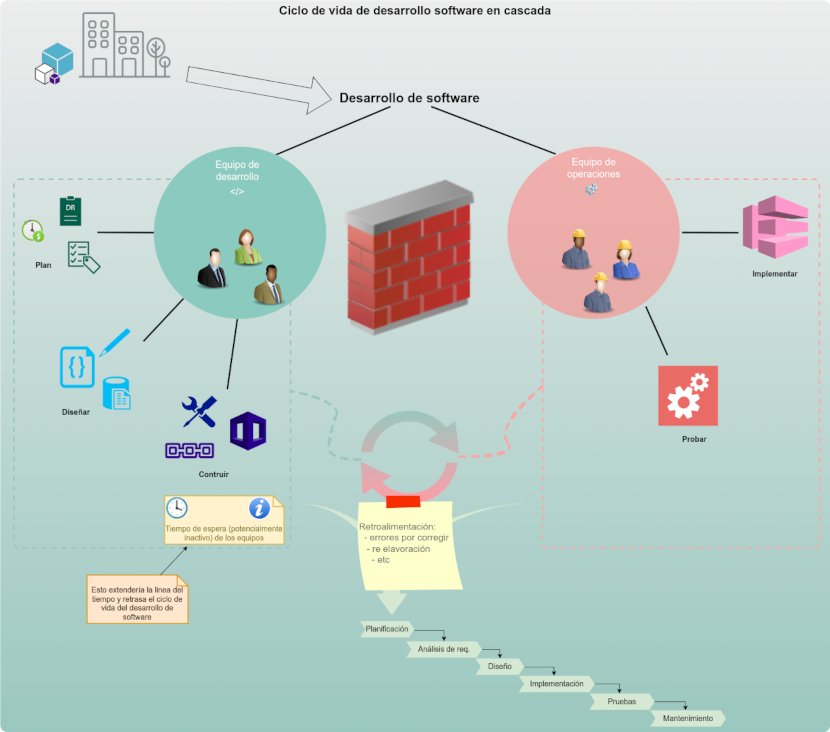

> __El enfoque tradicional de desarrollo de software__ sigue las fases de __Planificación__, __Análisis de Requisitos__, __Diseño__, __Implementación__, __Pruebas__ y __Mantenimiento__, conocido como el ___Modelo en Cascada___. Este modelo tiende a separar claramente las responsabilidades entre el equipo de desarrollo y el equipo de operaciones (sysadmin).

[Inconvenientes y desventajas del modelo tradicional](modelo-tradicional-desventajas.md)